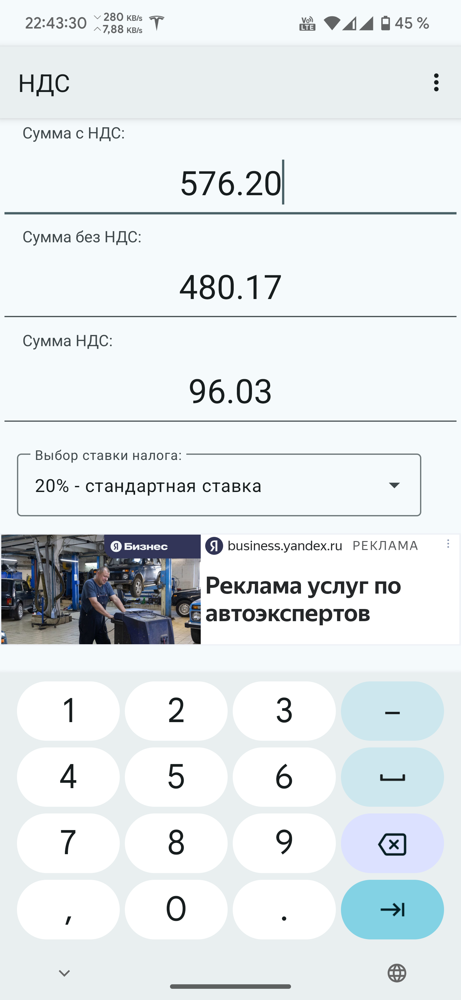
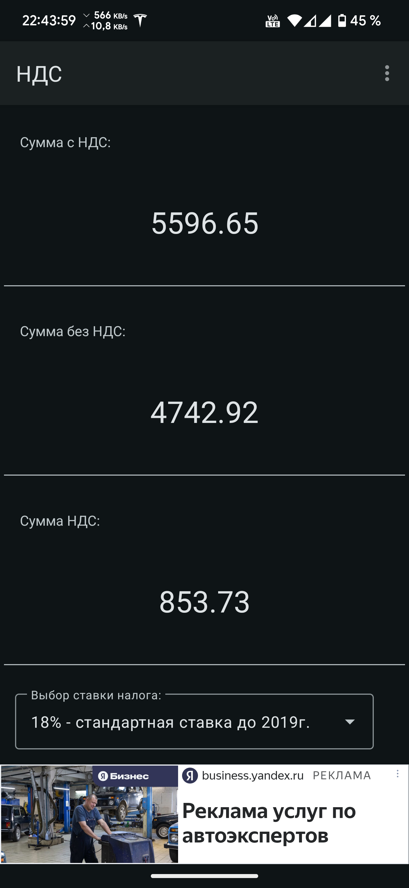
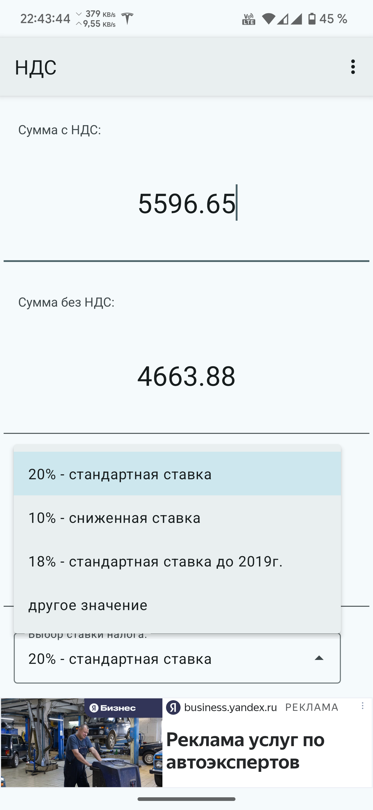
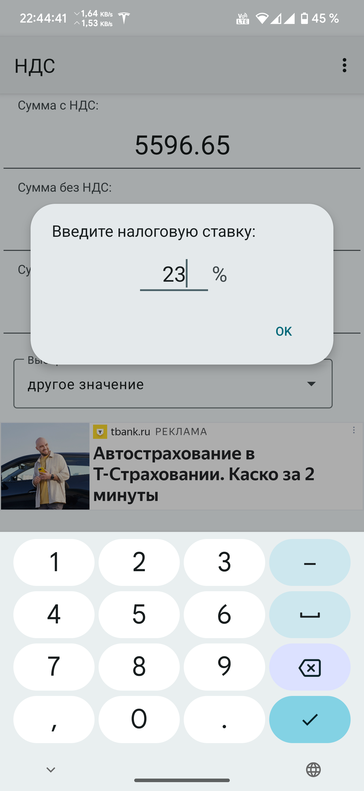
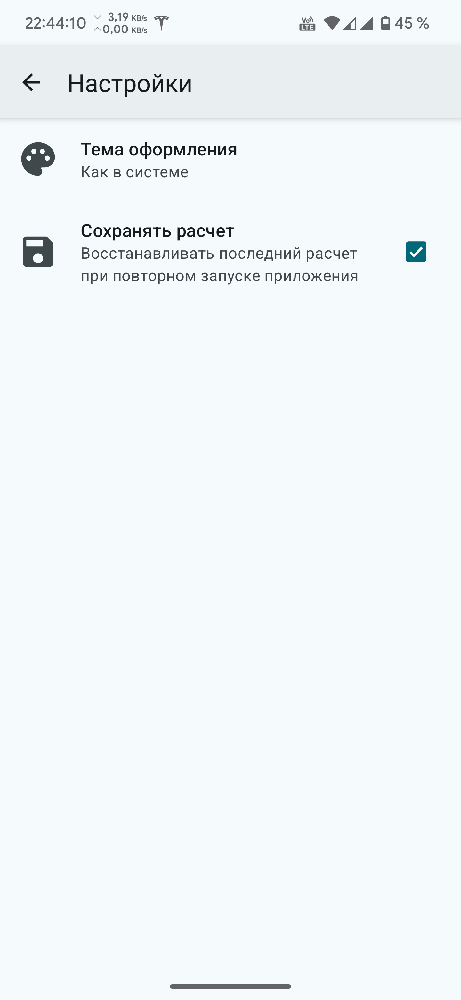
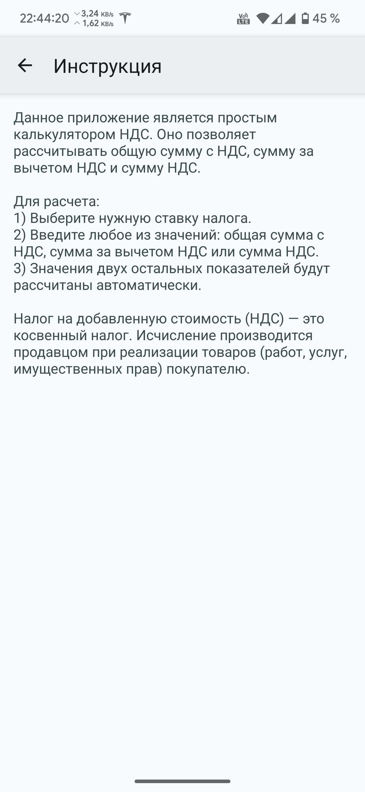

# Мобильное приложение "НДС"

## Описание проекта

Данное приложение является простым **калькулятором НДС**. Оно позволяет рассчитывать общую сумму, сумму к выплате и сумму налога к уплате.

**Налог на добавленную стоимость (НДС)** — это косвенный налог. Исчисление производится продавцом при реализации товаров (работ, услуг, имущественных прав) покупателю.

## Инструкция

**Для расчета выполните следующие действия:**

1. Выберите нужную ставку налога
2. Введите любое из значений: общая сумма, сумма за вычетом налога или сумма налога
3. Значения двух остальных показателей будут рассчитаны автоматически.

## Технологии

- **Язык программирования:** Kotlin
- **Рекламные технологии:** Yandex Mobile Ads SDK
- **Дизайн:** Material You
- **Динамический цвет:** Поддержка динамического изменения цветовой схемы в зависимости от обоев и темы устройства
- **Система навигации:** Predictive Back Gesture — поддержка жестов для предсказуемой навигации назад
- **Настройки:** Реализованы через файл PreferenceScreen, включающий кастомный выбор темы и опцию сохранения данных
- **Кастомные вью:** Использование собственных элементов интерфейса, таких как CustomListPreference

## Ссылки на Google Play и RuStore

Вы можете скачать и установить приложение "НДС" через **Google Play** или **RuStore** по ссылкам ниже:

<table>
  <tr>
    <td><a href="https://play.google.com/store/apps/details?hl=ru&gl=ru&id=com.den.shak.nds">
      
    </a></td>
    <td><a href="https://www.rustore.ru/catalog/app/com.den.shak.nds">
      
    </a></td>
  </tr>
</table>

## Скриншоты

Ниже представлены скриншоты приложения "НДС":

<table>
  <tr>
    <td></td>
    <td></td>
    <td></td>
  </tr>
  <tr>
    <td></td>
    <td></td>
    <td></td>
  </tr>
</table>

## Инструкция по сборке проекта

1. **Клонируйте репозиторий:**
   ```
   git clone https://github.com/Den-88/nds
2. **Откройте проект в Android Studio:**
   - В главном меню выберите **"Open an existing project"** и укажите путь к проекту.

3. **Синхронизируйте Gradle:**
   - Когда появится уведомление, нажмите **"Sync Now"** для загрузки всех зависимостей.

4. **Соберите и запустите проект:**
   - Выберите режим сборки (`Debug` или `Release`).
   - Нажмите **"Run"**, чтобы начать выполнение на устройстве или эмуляторе.

## Разработчик
- **Шакуров Денис Дамирович**
